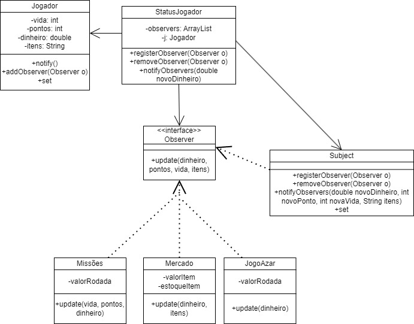

<h2>Observer (em manutenção e com pendÊncia de correção (Não tem herença))</h2>

Diagrama:

Código:
import java.util.ArrayList;

// Classe observer
public interface Observer {
    public void update(double dinheiro, int pontos, int vida, String itens);
}

// Classe Subject
public interface Subject {
    public void registerObserver(Observer o);
    public void removeObserver(Observer o);
    public void notifyObservers(double dinheiro, int pontos, int vida, String itens);
}

// Classe Jogador
public class Jogador implements Subject {
    private ArrayList<Observer> observers;
    private double dinheiro;
    private int pontos;
    private int vida;
    private String itens;

    public Jogador(double dinheiro, int pontos, int vida, String itens) {
        this.dinheiro = dinheiro;
        this.pontos = pontos;
        this.vida = vida;
        this.itens = itens;
        observers = new ArrayList<>();
    }

    public void registerObserver(Observer o) {
        observers.add(o);
    }

    public void removeObserver(Observer o) {
        observers.remove(o);
    }

    public void notifyObservers() {
        for (Observer observer : observers) {
            observer.update(dinheiro, pontos, vida, itens);
        }
    }

    public double receberDinheiro(double valor) {
        dinheiro += valor;
        notifyObservers();
        return dinheiro;
    }

    public int ganharPontos(int quantidade) {
        pontos += quantidade;
        notifyObservers();
        return pontos;
    }

    public int perderVida(int quantidade) {
        vida -= quantidade;
        notifyObservers();
        return vida;
    }

    public void adicionarItens(String novoItem) {
        itens += ", " + novoItem;
        notifyObservers();
    }
}

// Classe Teste
public class Teste {
    public static void main(String[] args) {
        Jogador jogador = new Jogador(30.0, 0, 100, "Maçã");
        Missoes missoes = new Missoes();
        Mercado mercado = new Mercado();
        JogoAzar jogoAzar = new JogoAzar();
        
        jogador.registerObserver(missoes);
        jogador.registerObserver(mercado);
        jogador.registerObserver(jogoAzar);
        
        jogador.receberDinheiro(200.0);
		jogador.ganharPontos(50);
        jogador.perderVida(20);
        jogador.adicionarItens("Espada Mágica");
    }
}

