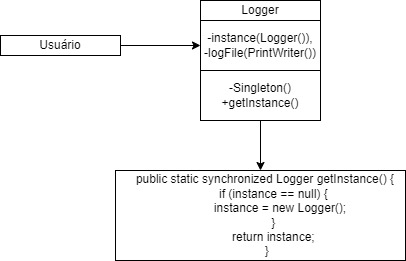

Singleton

Diagrama:
 

Código:
import java.util.ArrayList;
import java.util.List;

// Interface Bolo
interface Bolo {
    void criaForma(int x, int y);
    void criarDesenho();
}

// Entidade BoloRedondo
class BoloRedondo implements Bolo {
    private int x;
    private int y;
    private String arredondamento;

    public BoloRedondo(int x, int y, String arredondamento) {
        this.x = x;
        this.y = y;
        this.arredondamento = arredondamento;
    }

    @Override
    public void criaForma(int x, int y) {
        System.out.println("Criando forma do Bolo Redondo em (" + x + ", " + y + ")");
    }

    @Override
    public void criarDesenho() {
        System.out.println("Criando desenho do Bolo Redondo com arredondamento " + arredondamento);
    }
}

// Entidade Círculo
class Circulo implements Bolo {
    private int x;
    private int y;
    private String arredondamento;

    public Circulo(int x, int y, String arredondamento) {
        this.x = x;
        this.y = y;
        this.arredondamento = arredondamento;
    }

    @Override
    public void criaForma(int x, int y) {
        System.out.println("Criando forma do Círculo em (" + x + ", " + y + ")");
    }

    @Override
    public void criarDesenho() {
        System.out.println("Criando desenho do Círculo com arredondamento " + arredondamento);
    }
}

// Entidade IngredienteBolo (Composite)
class IngredienteBolo implements Bolo {
    private List<Bolo> children = new ArrayList<>();

    @Override
    public void criaForma(int x, int y) {
        System.out.println("Criando forma do IngredienteBolo em (" + x + ", " + y + ")");
        for (Bolo child : children) {
            child.criaForma(x, y); // Pode ajustar a lógica conforme necessário
        }
    }

    @Override
    public void criarDesenho() {
        System.out.println("Criando desenho do IngredienteBolo");
        for (Bolo child : children) {
            child.criarDesenho(); // Pode ajustar a lógica conforme necessário
        }
    }

    public void adicionar(Bolo child) {
        children.add(child);
    }

    public void remover(Bolo child) {
        children.remove(child);
    }
}

// Cliente
public class Main {
    public static void main(String[] args) {
        // Criando instâncias de bolos e ingredientes
        BoloRedondo boloRedondo = new BoloRedondo(10, 20, "Alto");
        Circulo circulo = new Circulo(30, 40, "Baixo");

        IngredienteBolo ingredienteBolo = new IngredienteBolo();
        ingredienteBolo.adicionar(boloRedondo);
        ingredienteBolo.adicionar(circulo);

        // Usando as instâncias
        ingredienteBolo.criaForma(5, 5);
        ingredienteBolo.criarDesenho();
    }
}
