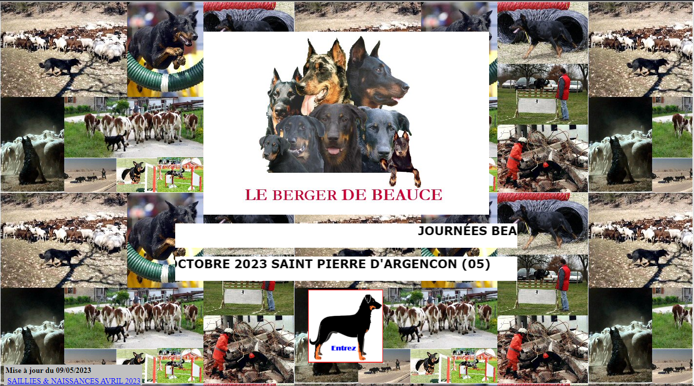
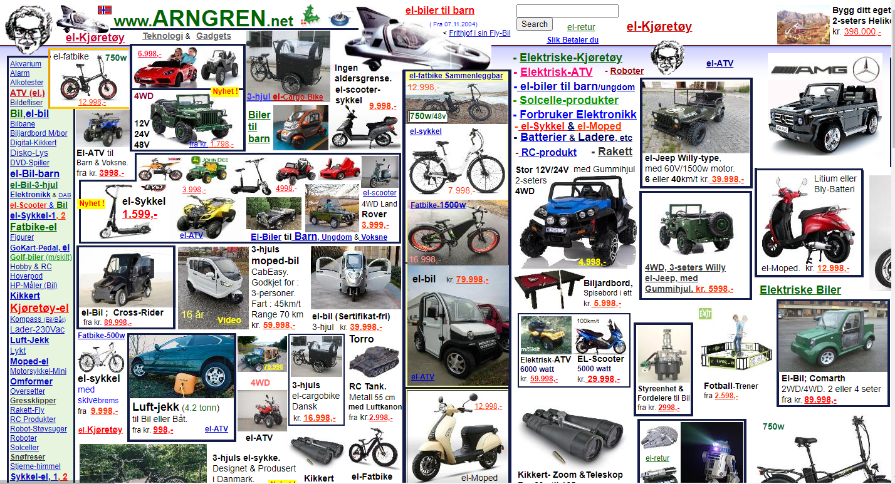
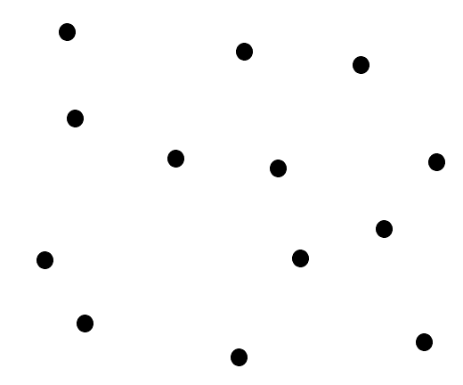
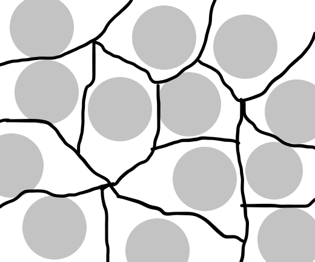
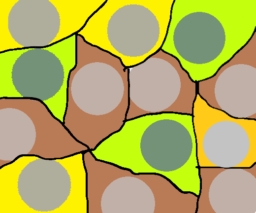
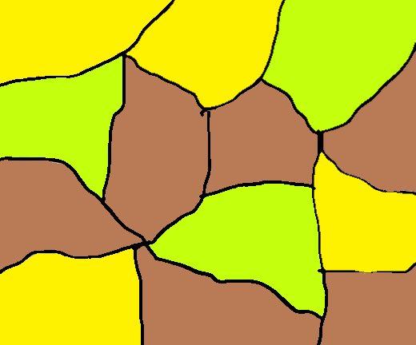
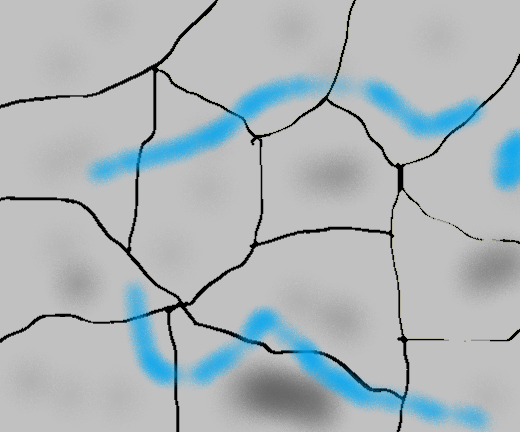

<h1 align="center">Interação Humano Computador</h1>
  

<h2>Interação Humano Computador em relação a usabilidade</h2>

A interação humano-computador (IHC) é uma disciplina que estuda a relação entre os seres humanos e os sistemas computacionais. A usabilidade é um dos principais conceitos estudados pela IHC, e refere-se à facilidade com que os usuários conseguem utilizar um sistema para realizar tarefas específicas. A usabilidade está diretamente relacionada à satisfação do usuário, e um sistema com boa usabilidade tende a ser mais aceito e utilizado pelos usuários.

O design UX (User Experience) e o design UI (User Interface) são duas abordagens diferentes dentro da IHC que visam melhorar a usabilidade dos sistemas computacionais.

O design UX refere-se à experiência do usuário ao utilizar um sistema, levando em consideração suas emoções, sentimentos e expectativas. O design UI, por outro lado, é a área responsável pela criação da interface do sistema, ou seja, como o usuário interage com o sistema.

A importância da IHC e do design UX/UI está em tornar os sistemas mais acessíveis e fáceis de usar pelos usuários, melhorando a experiência geral do usuário. Com uma boa usabilidade, os sistemas podem ser mais eficientes e eficazes, economizando tempo e reduzindo erros. Além disso, a usabilidade pode melhorar a produtividade e a satisfação do usuário, aumentando a aceitação e a adoção de um sistema.

A abordagem de Nielsen sobre a usabilidade destaca a importância da eficácia, eficiência e satisfação do usuário ao utilizar um sistema. De acordo com Nielsen, um sistema com boa usabilidade deve ser fácil de aprender e usar, minimizar a possibilidade de erros, fornecer feedback claro e oferecer controle ao usuário. Além disso, Nielsen também enfatiza a importância da consistência, da simplicidade e da visibilidade do sistema para melhorar a usabilidade.

<h3>Sites com pontos negativos de Nielsen:</h3>

<h3>SIGA</h3>

Trata-se do sistema online da Secretaria de Educação do Estado de São Paulo, utilizado pelos alunos para acessar informações sobre suas notas, frequência, calendário escolar, entre outras funcionalidades relacionadas à vida escolar.

<b>Consistência e padrões:</b> algumas seções do site apresentam layout e linguagem diferentes, o que pode confundir o usuário e gerar inconsistência no uso. Como neste exemplo, para o usuário que vai acessar pela primeira vez, vai achar estranho e inconsistência o tamanho das notícias e ao lado, vai estar o menu referente ao histórico, notas, documentos, etc.

   

<h3>Unifesp</h3>

<b>Consistência e Padronização:</b> O site é confuso na organização dos menu e no conteúdo, apresentando um layout  que não está padronizado e o menu apresenta várias subcategorias em um menu só desobecendo também, que nem o exemplo anterior, a heurística 4, onde fica díficil para o usuário se organizar e procurar por determinadas situações

   

<h3>Bing</h3>

É um motor de busca desenvolvido pela Microsoft, que permite aos usuários pesquisar informações na internet, imagens, vídeos, notícias, entre outros conteúdos.

<b>Correspondência entre o sistema e o mundo real:</b> o Bing utiliza algumas palavras de busca que podem não corresponder à terminologia que os usuários esperam. Por exemplo, ele exibe resultados para "sugestões de pesquisa" em vez de "correções de ortografia".

<b>Prevenção de erros:</b> o Bing não oferece sugestões para corrigir possíveis erros de digitação ou palavras-chave malformadas, o que pode levar a resultados irrelevantes ou nenhum resultado.

<b>Estética e design minimalista:</b> o Bing tem uma estética minimalista que pode ser considerada monótona para alguns usuários, sem o apelo visual de outros mecanismos de busca como o Google.

Comparando com o Google, o Bing tem uma interface mais simples e minimalista, que pode ser menos atraente visualmente. Além disso, o Google oferece sugestões de pesquisa e correções de erros de digitação de forma mais eficaz. Por outro lado, o Bing pode ser preferido por alguns usuários que valorizam a privacidade, pois a Microsoft (empresa responsável pelo Bing) tem políticas de privacidade mais rígidas do que o Google.

Já em comparação com o DuckDuckGo, que também é conhecido por ser um mecanismo de busca mais privado, o Bing pode ser visto como menos eficaz em termos de proteção de privacidade, já que a Microsoft tem acordos com outras empresas que podem compartilhar dados de pesquisa dos usuários. Além disso, o DuckDuckGo é mais consistente em relação aos padrões de design estabelecidos e oferece sugestões de pesquisa e correções de erros de forma semelhante ao Google.

   

<h3>E-bay</h3>

O eBay é um mercado online onde as pessoas compram e vendem itens. Comerciantes online (incluindo vendedores individuais) colocam itens à venda e permitem que os compradores participem de leilões online para comprar esses itens. Quando encontram um item que desejam, podem licitar por meio dos recursos de leilão online do eBay.

Ao comprar em um mercado online como o eBay, tomar uma decisão informada é fundamental. O eBay tenta resolver isso fornecendo um excesso de informações em suas páginas de produtos, mas, ao fazer isso, é uma sobrecarga de informações.

Na captura de tela acima, você vê o nome do item, preço, condição, quantidade disponível e número já vendido, bem como informações de envio, pagamento e devolução - e isso está logo acima da dobra. Há outra seção alternada com mais descrição e informações sobre remessa e pagamentos quando você rola.

O site também apresenta várias opções ao mesmo tempo. Os CTAs incentivam você a comprar o item, adicioná-lo ao carrinho ou salvá-lo na lista de observação. Mas há CTAs menores com hiperlinks convidando você a vender um item, se tiver um, ver o feedback dos compradores, verificar a garantia, aprender como obter um desconto no item, salvar este vendedor em sua lista de observação, visitar a loja, visualizar coisas semelhantes, e assim por diante.

<b>Flexibilidade e eficiência de uso:</b> Refere-se à capacidade do sistema de atender às necessidades de usuários com diferentes níveis de experiência e permitir que usuários experientes realizem tarefas de forma mais eficiente. Ao aplicar essa heurística ao site eBay, podemos observar um problema relacionado às páginas de produtos complexas, que pode afetar negativamente a flexibilidade e eficiência de uso do site.

As páginas de produtos no eBay são frequentemente compostas por uma grande quantidade de informações, incluindo imagens, descrições, informações de pagamento e envio, avaliações de vendedores e muito mais. Para usuários experientes que estão familiarizados com o site, essa quantidade de informações pode ser útil e fornecer uma visão geral completa do produto, no entanto, para usuários novos ou com pouca experiência, a complexidade da página de produtos pode ser esmagadora e tornar difícil encontrar informações importantes ou tomar uma decisão de compra informada.

Além disso, algumas páginas de produtos no eBay podem ser inconsistentes em relação ao layout e à organização das informações, o que pode confundir ainda mais os usuários. Por exemplo, as informações de envio e pagamento podem ser apresentadas em diferentes seções da página de produto, tornando difícil para o usuário encontrar todas as informações relevantes em um só lugar.

   

<h3>IMBDb</h3>

O Internet Movie Database (IMDb) é o maior e mais abrangente banco de dados de filmes da web. Ele oferece um extenso banco de dados de informações sobre filmes, programas de TV e elenco. O site foi lançado oficialmente em 1990 e agora é propriedade da Amazon.com.

O IMDB redesenhou muitas páginas da web, como sua página inicial, para uma experiência de usuário muito mais elegante . Mas algumas de suas páginas ainda têm o design desatualizado mostrado acima, que apresenta alguns pontos problemáticos de UX. Há pouco espaço em branco e cor, uma fonte relativamente pequena e muitos anúncios e outros conteúdos. Isso contribui para um layout desordenado e não torna mais fácil para os visitantes atingirem seu objetivo: descobrir mais sobre Scoot McNairy neste caso.

Também não há uma maneira fácil de navegar na página. Digamos que você queira aprender sobre os detalhes de McNairy, por exemplo. Você não teria escolha a não ser continuar rolando - passando por suas fotos, trabalhos em destaque, créditos e vídeos relacionados - até chegar a essa seção.

<b>Avaliação e feedback do usuário:</b> que se refere à capacidade do sistema de informar ao usuário sobre o que está acontecendo e fornecer feedback sobre as ações do usuário. Ao aplicar essa heurística ao site IMDb, podemos observar um problema relacionado ao layout desordenado que pode afetar negativamente a experiência do usuário e sua capacidade de receber feedback adequado.

Por exemplo, se o usuário tentar acessar uma página específica do site IMDb, mas o layout desordenado dificultar a localização dos botões de navegação ou informações relevantes, o usuário pode se sentir confuso e frustrado. Isso pode fazer com que ele se sinta incapaz de realizar a tarefa que tinha em mente, ou até mesmo abandone o site completamente.

Além disso, se o layout do site não estiver organizado de forma clara e coerente, pode ser difícil para o usuário entender como as diferentes seções do site se relacionam entre si. Isso pode afetar negativamente a capacidade do usuário de navegar pelo site e localizar informações relevantes, o que pode levar a uma experiência de usuário ruim.

   

<h3>Cuponomia</h3>
O site Cuponomia é um site brasileiro que reúne ofertas e cupons de descontos e cashback para compras no e-commerce. A startup, criada em 2012, por Antônio Miranda e Vinícius Dornela, tem como objetivo proporcionar economia aos consumidores por meio de seu portal que reúne cupons de descontos gratuitos e ofertas. 

De primeiro momento, existe muitos sites com o mesmo estilos e alguns, podem acaba trazendo falta de confiança em alguns usuários, entrando os seguintes heurísticas:

<b>Reconhecimento em vez de lembrança:</b> Pode ser violada, já que os sites de cupons podem apresentar uma sobrecarga de informações para os usuários. Isso pode tornar difícil para os usuários lembrarem de todos os códigos de desconto e promoções que estão disponíveis no site, o que pode levar à frustração e perda de oportunidades de economia.

<b>Avaliação e feedback do usuário:</b> Pode ser violada se os usuários tiverem dificuldade em encontrar e resgatar os cupons. Isso pode resultar em uma experiência frustrante e insatisfatória para o usuário, o que pode levar à perda de confiança e lealdade com o site.

Outro ponto negativo comum em sites de cupons é o uso de códigos de desconto expirados ou inválidos. Isso pode resultar em uma experiência negativa para o usuário e reduzir a confiança do usuário no site. Para evitar isso, é importante que os sites de cupons atualizem regularmente suas promoções e códigos de desconto e removam aqueles que expiraram ou se tornaram inválidos.

   

<h3>Aliexpress</h3>

AliExpress é uma plataforma chinesa que lida com vendas online de produtos de empresas chinesas. Na verdade, é um site que reúne muitos pequenos produtores que vendem itens de todos os tipos, de roupas a eletrônicos, de acessórios a artigos esportivos e muito mais.

Ao acessar, aparenta ser um site que lembra bastante outros lojas, com bara de pesquisa, menu, categorias na parte esquerda, promoção na primeira linha, entre outros.

Ao selecionar o produto, fica confuso de primeiro momento, por ser diferenciar de lojas comuns, por exemplo, Amazon, Mercado Livre, Americanas, Magazine Luiza, entre outros. 

<b>Reconhecimento em vez de memorização:</b> Aqui entra o ponto de memorização, a grande diferença entre reconhecer e memorizar é a quantidade de dicas fornecidas para que um conhecimento seja acessado, reconhecer padrões fornece muito mais dicas do que tentar acessar memórias e neste exemplo, apesar de ter traços de lembra outros lojas, ele se difere no quesito posições e mesclas partes que ficam estranho ao primeiro momento, por exemplos, identificar a loja ou o revendedor, quais as opções e onde fica a descrição da cor ou modelo ao selecionar, verificar produtos recomendados e filtrar os comentários, já que a função de mostrar avaliações positivos/negativas ou até mesmo por recentes, não funciona tão bem.

   

<h3>HackerNews</h3>

  Hacker News é um site de notícias sociais com foco em ciência da computação e empreendedorismo. É administrado pelo fundo de investimento e incubadora de startups Y Combinator
  

  
<b>Visibilidade do status do sistema:</b> A cor pequena e suave da fonte e a falta de espaço em branco podem tornar difícil para o usuário distinguir quais itens são ações separadas. Portanto, pode haver um problema de visibilidade do status do sistema.

<b>Correspondência entre o sistema e o mundo real:</b> As opções de ação são difíceis de identificar e compreender devido ao design. Isso pode indicar um problema de correspondência entre o sistema e o mundo real.
  
<b>Design estético e minimalismo:</b> A falta de espaço em branco, ícones e efeitos de foco podem tornar a interface do usuário menos esteticamente agradável e minimalista.
  
   
  
<h3>amisdubeauceron.org/</h3>

Este site não consta informação sobre a empresa, o que acaba sendo negativo de primeiro momento, dando a entender que ele trata de cachorros, mas não sabe-se se é doação, caridade ou informaçãoes sobre a raça, e caso, tiver opção de doação, o site não traz confiabildiade
  Way too many images
Outdated look and feel
No introduction about the business
  

<b>Flexibilidade e eficiência de uso:</b> O site contém muitas imagens na interface do usuário, isso pode dificultar a navegação e a busca de informações importantes. Portanto, pode haver um problema de flexibilidade e eficiência de uso, pois os usuários podem ter dificuldade em encontrar o que estão procurando.

<b>Design estético e minimalismo:</b> O visual e a sensação da interface do usuário parecerem desatualizados, isso pode afetar negativamente a percepção do usuário sobre a qualidade do site. Além disso, se houver muitas imagens desatualizadas, isso pode contribuir para a falta de um design estético e minimalista.

<b>Consistência e padrões:</b> Se não houver apresentação clara sobre o negócio ou os objetivos do site, isso pode ser considerado um problema de consistência e padrões. Os usuários podem ter dificuldade em entender o propósito do site e o que esperar dele, o que pode levar a uma experiência frustrante ou confusa.
  
   

<h3>arngren</h3>

Arngren.net é um site norueguês fundado em 2002 pela Arngren Electronics, que é usado principalmente para vender todo tipo de gadgets e eletrodomésticos estranhos. O site propõe uma coleção em massa de vários itens de veículos (por exemplo, bicicletas, scooters, bicicletas e carros) para colecionáveis eletrônicos para compra. Embora a página da Web cumpra sua tarefa de mostrar todos os seus itens comercializáveis, a interface do usuário é um caos
  

  
<b>Consistência e padrões:</b> A descrição indica que os elementos do site parecem desorganizados, com divs empilhados uns sobre os outros e texto desalinhado quando os usuários clicam em um produto ou dão zoom. Isso pode ser um problema de consistência e padrões, pois os usuários podem esperar que as informações sejam organizadas de forma lógica e fácil de ler.

<b>Reconhecimento em vez de recordação:</b> Se o site não estiver organizado de forma lógica, os usuários podem ter dificuldade em reconhecer o que estão procurando e em lembrar onde encontraram informações específicas anteriormente. Isso pode tornar a navegação do site mais desafiadora.

<b>Feedback do sistema:</b> A descrição indica que as imagens estão deslocadas e malformatadas quando os usuários dão zoom ou vão para a parte de fora. Isso pode ser um problema de feedback do sistema, pois os usuários podem não receber feedback adequado sobre suas ações e podem ter dificuldade em entender como interagir com o site.
  
<b>Prevenção de erros:</b> O site pode ser desafiador de usar e pode levar os usuários a cometer erros, como clicar no produto errado ou não encontrar a informação que estão procurando. É importante que o site tenha medidas para prevenir erros, como a confirmação de ações importantes ou a inclusão de informações claras sobre o que cada elemento do site faz.

<b>Estética e design minimalista:</b> A descrição indica que o site parece desatualizado e tem elementos desorganizados. É importante que o site tenha uma estética e design 
  
   

<h3>Suzanne Collins Books</h3>
  
É um site sobre a escritora Suzanne Marie Collins, também roteirista de ficção científica e literatura infanto-juvenil americana, conhecida pela trilogia Jogos Vorazes que virou filme sob título homônimo em 2012.
  

<b>Visibilidade do status do sistema:</b> O site pode não fornecer informações suficientes sobre seu status e suas operações em andamento. É importante que o site forneça informações claras sobre o que está acontecendo para os usuários, incluindo mensagens de erro ou de sucesso.
  
<b>Prevenção de sobrecarga de informação:</b> O site pode ter pouca informação, mas ainda assim pode ser difícil de entender para os usuários que procuram informações específicas. É importante que o site previna a sobrecarga de informações, organizando as informações de maneira lógica e fácil de usar.
  
<b>Correspondência entre o sistema e o mundo real:</b> O site pode não corresponder à realidade, com informações limitadas sobre a autora e sua obra. É importante que o site corresponda ao mundo real, com informações claras e fáceis de entender sobre a autora e suas obras.

<b>Controle e liberdade do usuário:</b> O site pode não oferecer opções claras para o usuário voltar atrás ou desfazer uma ação. É importante que o site forneça aos usuários o controle e liberdade para navegar e explorar o site como desejarem.

<b><h3>Em andamento...</h3></b>
  
    
  
  
  
  
  
  
  

  
  
  
  
  
  
  
  
  
  
  
  
  
  
  
  
  
  
  
  
  
  
  
  
  
  
  
  
  
  
  
  <h1>Geração Procedural em Jogos: Explorando a Criatividade e a Diversão</h1>

<h2>Introdução</h2>

A indústria de jogos eletrônicos tem testemunhado um avanço significativo nas últimas décadas, impulsionado pelo desenvolvimento de gráficos e jogabilidade cada vez mais sofisticados. Um dos aspectos que contribui para essa evolução é a geração procedural em jogos, uma técnica que permite a criação automática de conteúdo por meio de algoritmos e regras pré-estabelecidas. Neste artigo, iremos explorar em detalhes a geração procedural em jogos, analisando seu funcionamento, vantagens e desafios, além de examinar exemplos notáveis de jogos que utilizam essa abordagem

<h2>1.Entendendo a Geração Procedural</h2>

<h2>1.1 Conceito e Definição</h2>
	
A geração procedural em jogos refere-se à criação automática de conteúdo dentro do jogo, utilizando algoritmos e regras para gerar elementos como cenários, níveis, objetos e histórias. Ao contrário da criação manual de conteúdo, em que os desenvolvedores criam cada elemento individualmente, a geração procedural permite que o jogo crie conteúdo de forma dinâmica, oferecendo experiências únicas a cada partida.

A geração procedural é baseada em algoritmos que são capazes de criar conteúdo de forma aleatória, porém controlada. Esses algoritmos podem ser programados para seguir regras específicas, como limites de tamanho, distribuição de elementos e restrições de jogabilidade. Dessa forma, a geração procedural permite uma ampla variedade de conteúdo, ao mesmo tempo em que garante que ele seja coerente e adequado ao jogo.

<h2>1.2 Aplicações em Jogos</h2>

A geração procedural pode ser aplicada de várias maneiras em jogos, proporcionando experiências diferentes e emocionantes. Alguns exemplos notáveis de aplicações da geração procedural incluem:

<b>Geração de níveis:</b> Em jogos de plataforma, como o Super Mario, a geração procedural é usada para criar níveis de forma automática. Isso permite que cada partida ofereça um nível único, com desafios e obstáculos variados, garantindo que o jogador nunca se canse de jogar.

<b>Geração de cenários:</b> Jogos como o Minecraft utilizam a geração procedural para criar mundos infinitos compostos por blocos. Cada vez que um jogador inicia um novo jogo, um novo mundo é gerado, proporcionando uma experiência de exploração e descoberta constante.

<b>Geração de histórias:</b> Em jogos de RPG, a geração procedural pode ser usada para criar histórias e missões de forma dinâmica. Isso permite que cada partida conte uma história única, adaptada às escolhas e ações do jogador, tornando a experiência mais imersiva e personalizada.

<b>Geração de personagens e inimigos:</b> Alguns jogos utilizam a geração procedural para criar personagens não jogáveis (NPCs) e inimigos. Isso possibilita a criação de uma variedade de personagens com características distintas, tornando o mundo do jogo mais vivo e diversificado.

<h2>2. Vantagens da Geração Procedural</h2>

<h3>2.1 Variedade e Replayability</h3>

Uma das principais vantagens da geração procedural em jogos é a capacidade de oferecer variedade e replayability. Com a geração procedural, cada partida se torna única, já que o conteúdo é criado de forma dinâmica. Isso significa que os jogadores podem experimentar novos desafios, cenários e histórias a cada vez que jogam, evitando a sensação de repetição e aumentando a longevidade do jogo.

Além disso, a geração procedural permite que os desenvolvedores criem jogos com uma quantidade praticamente infinita de conteúdo. Em vez de criar manualmente cada nível, cenário ou missão, os algoritmos podem gerar esses elementos de forma automática, proporcionando uma variedade quase ilimitada ao jogo. Isso é especialmente benéfico em jogos de mundo aberto, onde a exploração é um elemento central da jogabilidade.

<h3>2.2 Eficiência e Escalabilidade</h3>

Outra vantagem da geração procedural é a eficiência e escalabilidade que ela oferece aos desenvolvedores. Criar conteúdo manualmente para um jogo pode ser um processo demorado e trabalhoso, exigindo uma equipe de desenvolvimento dedicada e recursos significativos. Com a geração procedural, parte desse trabalho é automatizado, permitindo que os desenvolvedores criem conteúdo de forma mais rápida e eficiente.

Além disso, a geração procedural torna o jogo escalável, ou seja, ele pode se adaptar à escala desejada sem comprometer a qualidade. Se um jogo tem a capacidade de gerar automaticamente novos níveis, por exemplo, ele pode oferecer um número quase infinito de desafios sem a necessidade de criação manual de cada um. Isso significa que os jogos podem crescer e se expandir facilmente, atendendo às demandas dos jogadores e proporcionando uma experiência sempre fresca.

<h3>2.3 Criatividade e Surpresa</h3>

A geração procedural estimula a criatividade tanto dos desenvolvedores quanto dos jogadores. Para os desenvolvedores, a geração procedural oferece uma oportunidade de explorar novas ideias e experimentar diferentes combinações de elementos dentro do jogo. Eles podem criar sistemas complexos de geração procedural que resultam em conteúdo inesperado e surpreendente, oferecendo momentos memoráveis aos jogadores.

Para os jogadores, a geração procedural aumenta a sensação de surpresa e descoberta. Cada partida se torna uma experiência única, na qual eles podem encontrar novos desafios, ambientes e eventos imprevistos. Isso mantém o jogo interessante e cativante, incentivando os jogadores a explorar e experimentar diferentes abordagens a cada vez que jogam.

<h2>3. Desafios e Limitações da Geração Procedural</h2>

<h3>3.1 Controle da Qualidade</h3>

Um dos principais desafios da geração procedural em jogos é manter a qualidade do conteúdo gerado. Embora a geração procedural ofereça variedade e criatividade, também há o risco de gerar conteúdo que não atenda aos padrões desejados. Elementos gerados proceduralmente podem apresentar problemas como falta de coerência, bugs, dificuldades excessivas ou excesso de repetição.

Para lidar com esse desafio, os desenvolvedores precisam implementar mecanismos de controle de qualidade que monitorem e avaliem o conteúdo gerado proceduralmente. Isso pode envolver a implementação de algoritmos de detecção de problemas, testes rigorosos e ajustes manuais quando necessário. Garantir que o conteúdo gerado atenda aos padrões de qualidade estabelecidos é essencial para oferecer uma experiência de jogo satisfatória aos jogadores.

<h3>3.2 Coerência e Consistência</h3>

Outro desafio da geração procedural é manter a coerência e consistência do conteúdo gerado. Como o conteúdo é criado de forma aleatória, há o risco de que os elementos gerados não se encaixem de forma coesa no jogo, resultando em uma sensação de aleatoriedade excessiva.

Para evitar esse problema, os desenvolvedores precisam estabelecer regras e restrições claras para a geração procedural. Isso envolve definir parâmetros que garantam que o conteúdo gerado seja consistente em termos de estilo, dificuldade, distribuição de elementos e outros aspectos relevantes. Também é possível usar técnicas como algoritmos genéticos ou aprendizado de máquina para refinar e melhorar os resultados da geração procedural, garantindo que o conteúdo se encaixe de forma adequada no jogo.

<h3>3.3 Balanceamento e Ajustes</h3>

O balanceamento do jogo pode ser um desafio quando o conteúdo é gerado proceduralmente. Como o jogo pode criar desafios, níveis ou inimigos de forma dinâmica, é necessário garantir que a experiência de jogo seja equilibrada e justa para os jogadores.

Os desenvolvedores precisam ajustar os algoritmos de geração procedural para controlar a dificuldade, a progressão do jogo e a distribuição de elementos. Isso pode envolver o estabelecimento de parâmetros que regulem a geração de conteúdo, o monitoramento dos resultados e a realização de ajustes em tempo real para garantir que o jogo ofereça uma experiência desafiadora, mas ao mesmo tempo acessível e divertida.

<h2>4. Exemplos de Jogos que Utilizam Geração Procedural</h2>

<h3>4.1 Super Mario</h3>

O Super Mario é um exemplo clássico de jogo que utiliza a geração procedural para criar níveis de forma automática. Cada vez que o jogador inicia uma partida, o jogo gera um novo nível com obstáculos, inimigos e itens dispostos de maneira aleatória. Isso proporciona uma experiência única a cada jogo, mantendo a jogabilidade fresca e desafiadora.

A geração procedural de níveis no Super Mario também influencia diretamente a jogabilidade. Os jogadores precisam se adaptar a novos desafios a cada partida, testar diferentes estratégias e descobrir maneiras criativas de superar os obstáculos. Isso torna o jogo mais dinâmico e estimula a criatividade dos jogadores.

<h4>4.1.1 Características</h4>

O jogo, por ter tiles e posições fixas, foi criado então o MarioGPT, que une justamente essa ideia, de gerar fases de forma aleatória, deixando o jogador mais interessado em jogar, já que não enfrentará os mesmos tipos de fases

Utiliza o GPT2, por ser mais leve, então gerará níveis básicos, mas que mesmo assim, a precisão é ótima, pois pode gerar uma fase com muitos inimigos e poucos blocos ou com muitos blocos e poucos inimigos, com baixa ou alta elevação ou até mesmo espaço de pulo entrar dois blocos.

Para o programa entender o jogo, é usado caracteres e texto especiais no Prompt de Comando, onde cada caractere é um símbolo atribuído à um elemento do jogo. É aqui que realiza toda a programação e no final, apenas converte para a fases em final. 

Raramente, pode ocorrer falhas, por exemplo, ser impossível de passar em determinada parte, mas como não é comum, pode ter até a função do usuário pode editar a fase também, sendo uma combinação perfeita.

  <h3>4.2 Minecraft</h3>

O Minecraft é um jogo de mundo aberto que utiliza extensivamente a geração procedural para criar cenários. Seguindo várias regras para geração de terreno, o Minecraft gera seu mundo baseado em blocos em pedaços de 16 por 16 blocos. Quando um jogador entra em um novo pedaço pela primeira vez, os pedaços ao seu redor são gerados, formando montanhas, árvores, cavernas e outras características da paisagem.

A geração procedural em Minecraft também estimula a criatividade dos jogadores. Eles podem usar os blocos disponíveis para construir suas próprias estruturas, encontrar aldeias e até mesmo enfrentar criaturas desafiadoras. A geração procedural torna o jogo altamente personalizável e oferece uma infinidade de possibilidades aos jogadores.

<h4>4.2.1 Caracteristicas</h4>

O mundo é tridimensional, discreto (composto por blocos de tamanho unitário), limitado no eixo z por 0 e 255, e ilimitado é o eixo x e y.

O mundo contém biomas, cada um abrangendo grandes áreas horizontais, que definem a natureza do espaço que o bioma ocupa, além disso tudo, também contém rios, lagos e oceanos.

Todo mundo é definido por uma seed (semente). A mesma seed sempre gerará o mesmo mundo.

<b>Seeds</b>

Quando inicia o jogo, um número aleatório de 64 bits chamado ‘Seed’ é gerado (ou escolhido pelo jogador), que é usado para criar o mundo. Ao criar um novo mundo, pode optar por criar seu próprio mundo inserindo uma semente usada pelo gerador de mundos.

Se não especificar um valor de semente ao criar um novo mundo, será usado um valor de semente aleatório. Se um jogador quiser usar uma semente específica para criar um mundo específico, deve fazê-lo antes que o mundo seja criado, pois não pode ser alterado posteriormente. Sementes diferentes criarão mundos diferentes e, se usar a mesma semente, obterá sempre o mesmo resultado (pelo menos na mesma versão do Minecraft, pois os detalhes da geração do terreno mudam de versão para versão). 

Se os números também fossem usados no código inicial, um algoritmo especial poderia criar impressionantes 281 trilhões de mundos diferentes. Essa diferença ocorre porque o gerador de mundo pode reconhecer apenas 4 bilhões de palavras, portanto, apenas o código-fonte do Minecraft será gerado para essas palavras. Com essas sementes, 4 bilhões de mundos teóricos podem ser criados usando apenas palavras. Uma semente está associada a um mundo específico e pode ter diferentes números para defini-la, pois as possibilidades de criação de mundos do Minecraft são quase ilimitadas.
	
Outros ajustes de bioma levam seu valor de repetição infinita a um nível totalmente diferente. A geração de paisagens no jogo realmente ocorre em dois níveis diferentes: uma “peça” separada e o mundo como um todo. Então, conforme você explora o mundo, novos fragmentos serão gerados ao seu redor, criando a ilusão de um mundo vasto e contínuo. Você pode ver novas terras sendo criadas conforme você se move pelo mundo.

<b>Chunk</b>

	No contexto de jogos, um "chunk" é uma unidade de divisão espacial usada para gerenciar o carregamento e a renderização de áreas do mundo virtual. Em vez de carregar e renderizar o mundo inteiro de uma vez, o jogo é dividido em "chunks" menores, permitindo um melhor desempenho e gerenciamento de recursos.

Em termos técnicos, um "chunk" é uma região retangular tridimensional do mundo do jogo. No Minecraft, por exemplo, cada "chunk" tem uma altura fixa de 256 blocos (do leito do mar até o limite superior do mundo). Horizontalmente, cada "chunk" tem uma dimensão de 16 blocos por 16 blocos. Portanto, um "chunk" no Minecraft representa uma área de 16x256x16 blocos no mundo.

Os "chunks" são carregados e descarregados dinamicamente conforme o jogador se move pelo mundo. Quando o jogador se move para uma nova área, os "chunks" próximos à posição atual do jogador são carregados na memória e são renderizados na tela. Isso permite que o jogador explore o mundo em tempo real, enquanto o jogo carrega apenas as partes necessárias.

O carregamento e a descarga dos "chunks" são gerenciados pelo motor do jogo. O motor do jogo monitora a posição do jogador e determina quais "chunks" precisam ser carregados ou descarregados com base na distância do jogador em relação aos "chunks" existentes. Isso é feito de forma contínua à medida que o jogador se move pelo mundo.

Além disso, os "chunks" podem conter informações adicionais, como dados de terreno, biomas, entidades (como criaturas e itens), recursos naturais, estruturas geradas proceduralmente e outras características do mundo. Essas informações são armazenadas em arquivos ou estruturas de dados para acesso eficiente durante a renderização e o gameplay.

A divisão em "chunks" traz vantagens em termos de desempenho e eficiência de memória. Em vez de carregar e processar o mundo inteiro, o jogo pode se concentrar apenas nos "chunks" visíveis ou relevantes para o jogador. Isso permite que jogos com mundos vastos sejam executados em hardware limitado, evitando a sobrecarga de recursos.

Em resumo, os "chunks" são unidades de divisão espacial usadas em jogos para gerenciar o carregamento, a renderização e o processamento de áreas do mundo virtual. Eles permitem um melhor desempenho, otimização de recursos e uma experiência de jogo suave enquanto o jogador explora o mundo em tempo real.

<b>Mundos</b>

Para facilitar o processo de geração, dividiremos nosso mundo em pedaços. Cada pedaço ocupará um espaço de 1024 × 1024 × 256 blocos.

Cada pedaço é gerado separadamente. Isso nos ajudará a salvar, carregar o mundo e gerar mais partes do mundo facilmente.

<B>Fronteiras dos biomas</B>

O mundo é dividido em células nos eixos x e y, cada uma de um determinado bioma. Atribuiremos a cada célula um ponto que representa seu centro.

<b>Ruído branco</b>

O ruído branco é um conceito fundamental na geração procedural de terrenos em jogos como o Minecraft. O ruído branco é uma forma de ruído aleatório que possui igual intensidade em todas as frequências. Ele é chamado de "branco" porque, assim como a luz branca, contém uma mistura de todas as frequências possíveis.

No contexto da geração de terrenos, o ruído branco é usado para criar variações e imperfeições nos elementos do ambiente, como elevações, relevos e texturas. Ele adiciona detalhes e realismo aos cenários gerados, tornando-os visualmente interessantes e mais naturais.

O ruído branco é gerado por algoritmos matemáticos que produzem valores aleatórios distribuídos uniformemente. Esses valores são aplicados a coordenadas espaciais para determinar a altura e outros atributos do terreno em cada ponto. Ao adicionar o ruído branco à geração procedural, é possível obter uma aparência orgânica e variada, simulando a complexidade dos ambientes naturais.

Os algoritmos de ruído branco podem ser ajustados para controlar a escala e a intensidade das variações geradas. Isso permite aos desenvolvedores de jogos ajustar a aparência do terreno de acordo com as necessidades do jogo, criando desde paisagens suaves e suavemente onduladas até terrenos acidentados e montanhosos.

Além disso, o ruído branco pode ser combinado com outros algoritmos e técnicas de geração procedural, como a interpolação de valores entre pontos vizinhos, para criar transições suaves entre diferentes biomas e características do terreno. Essas combinações permitem a criação de paisagens mais complexas e diversificadas, ampliando as possibilidades de exploração e interação dos jogadores.

<b>Elevação</b>

O ruído por si só é apenas um monte de números. Precisamos atribuir significado a ela. A primeira coisa que podemos pensar é fazer com que o ruído corresponda à elevação (também chamado de “mapa de altura”).

elevação [y][x] = ruído(nx, ny);

<b>Frequência</b>

O ruído pode ser gerado em qualquer frequência. 

elevação[y][x] = ruído(frequência* nx,frequência* ny);

Às vezes é útil pensar no comprimento de onda, que é o inverso da frequência. A frequência é medida em oscilações por distância. Dobrar a frequência deixa tudo com metade do tamanho. O comprimento de onda é medido em distância por oscilação, medido em pixels ou ladrilhos ou metros, etc. Dobrar o comprimento de onda faz com que tudo tenha o dobro do tamanho. O comprimento de onda está relacionado com a frequência:

wavelength = map_size / frequency.

elevação[y][x] = ruído(x / comprimento de onda , y / comprimento de onda );

Tenho outro tutorial que explica os conceitos: frequência, comprimento de onda, amplitude, oitavas, ruído rosa e azul e branco, etc.

<h4>4.2.2 Algoritmos</h4>

	
Aqui, são utilizadas várias ferramentas, um exemplo é a geração de mapas por ruídos. Inicialmente, imagina-se um mapa plano, e existe pontos espalhado por todo este mapa.

Figura 1 - Mapa com pontos espalhados

	Cada ponto é um bioma, que vai ser dissipando ao redor de forma aleatório, até ter o contato com outras dissipações e nisto, é criado linhas que separam cada bioma e dentro de cada ponto com sua dissipação, vai ter uma cor indicando os diferentes tipos.

Figura 2 - Após a dissipação, ocorre a divisão dos biomas através de linhas

Figura 3 - Mapa onde os pontos vão se dissipando
     

Figura 4- Cada cor representa um bioma diferente
   

Figura 5 - Divisão final dos biomas

Após isso, o ruído entrar, onde vamos ter partes escuras e pretas, que vão indica a latitude das montanhas, e aqui, são criados as paisagens e os planos do terreno, se é fundo, plano ou alto e em azul, onde vai ser gerado os lagos, rios ou oceano.

 
Figura 6- Ruído branco, onde escuro indica elevação e mais claro, mais fundo. Também há a presença de águas em azul

Depois disso, a geração de NPCs* (Non-player characters) e itens vão aparecer em locais estratégicos, tendo o cuidado de aparecer em lugares impossíveis ou que dificulte o acesso do player, mas no caso do jogo em especifico, é comum acontecer isso, o que torna o mesmo desafiante e divertido.
	
	*NPC: NPC é um acrônimo que significa "personagem não-jogador". Um personagem não-jogador é um personagem em um jogo que não é controlado pela pessoa que está jogando, nem por qualquer tipo de IA. Eles geralmente não devem agir como pessoas reais.

Após isso, o mapa se torna um “3D”, criando camadas por baixo, onde vai ser gerado as cavernas e também as posições estratégicas de minérios e de ameaças também.

Tudo isso é randômico, até mesmo quando há a troca para outras dimensões, através de portais, onde ao entrar, esta outra dimensão é gerada com as mesmas regras ditas e a posição do portal do outro lado é randômico, pois o jogador pode sair em lugares seguros, perigosos ou até mesmo em um lugar que não há saída ou cercado por tudo.	

<h2>Conclusão</h2>

A geração procedural em jogos oferece uma série de benefícios, como variedade, replayability, eficiência e criatividade. Ela permite que os jogos ofereçam experiências únicas a cada partida, evitando a sensação de repetição e aumentando a longevidade do jogo, e além disso, torna o desenvolvimento de jogos mais eficiente e escalável, permitindo que os jogos sejam expandidos facilmente.

Também apresenta desafios, como o controle da qualidade, a manutenção da coerência e consistência, e o balanceamento do jogo. Os desenvolvedores precisam implementar mecanismos de controle e ajustes para garantir que o conteúdo gerado atenda aos padrões desejados e ofereça uma experiência de jogo equilibrada e divertida.

Apesar dos desafios, esta tecnologia em jogos continua a evoluir e a ser aplicada em uma variedade de gêneros e estilos de jogos. Com o avanço da tecnologia e o refinamento dos algoritmos, podemos esperar experiências ainda mais emocionantes e imprevisíveis proporcionadas pela geração procedural nos jogos do futuro.

<h2>Referência Bibliográfica:</2>

BARTHET, Matthew, LIAPIS Antonios e N. YANNAKAKIS Georgios. <b>"Open-Ended Evolution for Minecraft Building Generation."</b> ArXiv Preprint arXiv:2104.08890 (2022). Disponível em: https://arxiv.org/abs/2209.03108

SUDHAKARAN, Shyam, Miguel González-Duque, Claire Glanois, Matthias Freiberger, Elias Najarro, e Sebastian Risi. <b>"MarioGPT: Open-Ended Text2Level Generation through Large Language Models."</b> ArXiv Preprint arXiv:2302.05981 (2023). Disponível em: https://arxiv.org/abs/2302.05981

PYARELAL, Adarsh, BANERJEE Aditya, e BARNARD, Kobus. <b>"Modular Procedural Generation for Voxel Maps."</b> ArXiv Preprint arXiv:2104.08890 (2021). Disponível em: https://arxiv.org/abs/2104.08890

BLOB GAMES, Red. <b>"Making maps with noise functions."</b> Disponível em: https://www.redblobgames.com/maps/terrain-from-noise/

BILAL, Himite. <b>"Replicating Minecraft World Generation in Python: Using Voronoi diagrams and a lot of Perlin/Simplex noise."</b> Towards Data Science, 17 de novembro de 2021. Disponível em: https://towardsdatascience.com/replicating-minecraft-world-generation-in-python-1b491bc9b9a4

  
  
  
  
  
  
  
  
  
  
  
  

