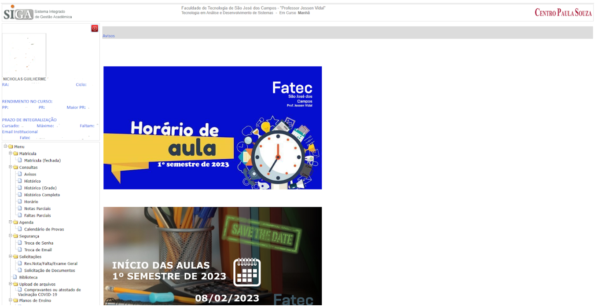

<h1 align="center">Interação Humano Computador</h1>
  
<h2>Interação Humano Computador em relação a usabilidade</h2>

A interação humano-computador (IHC) é uma disciplina que estuda a relação entre os seres humanos e os sistemas computacionais. A usabilidade é um dos principais conceitos estudados pela IHC, e refere-se à facilidade com que os usuários conseguem utilizar um sistema para realizar tarefas específicas. A usabilidade está diretamente relacionada à satisfação do usuário, e um sistema com boa usabilidade tende a ser mais aceito e utilizado pelos usuários.

O design UX (User Experience) e o design UI (User Interface) são duas abordagens diferentes dentro da IHC que visam melhorar a usabilidade dos sistemas computacionais.

O design UX refere-se à experiência do usuário ao utilizar um sistema, levando em consideração suas emoções, sentimentos e expectativas. O design UI, por outro lado, é a área responsável pela criação da interface do sistema, ou seja, como o usuário interage com o sistema.

A importância da IHC e do design UX/UI está em tornar os sistemas mais acessíveis e fáceis de usar pelos usuários, melhorando a experiência geral do usuário. Com uma boa usabilidade, os sistemas podem ser mais eficientes e eficazes, economizando tempo e reduzindo erros. Além disso, a usabilidade pode melhorar a produtividade e a satisfação do usuário, aumentando a aceitação e a adoção de um sistema.

A abordagem de Nielsen sobre a usabilidade destaca a importância da eficácia, eficiência e satisfação do usuário ao utilizar um sistema. De acordo com Nielsen, um sistema com boa usabilidade deve ser fácil de aprender e usar, minimizar a possibilidade de erros, fornecer feedback claro e oferecer controle ao usuário. Além disso, Nielsen também enfatiza a importância da consistência, da simplicidade e da visibilidade do sistema para melhorar a usabilidade.

<h3>Sites com pontos negativos de Nielsen:</h3>

<h3>SIGA</h3>

Trata-se do sistema online da Secretaria de Educação do Estado de São Paulo, utilizado pelos alunos para acessar informações sobre suas notas, frequência, calendário escolar, entre outras funcionalidades relacionadas à vida escolar.

<b>Consistência e padrões:</b> algumas seções do site apresentam layout e linguagem diferentes, o que pode confundir o usuário e gerar inconsistência no uso. Como neste exemplo, para o usuário que vai acessar pela primeira vez, vai achar estranho e inconsistência o tamanho das notícias e ao lado, vai estar o menu referente ao histórico, notas, documentos, etc.

<h3>Unifesp</h3>

<b>Consistência e Padronização:</b> O site é confuso na organização dos menu e no conteúdo, apresentando um layout  que não está padronizado e o menu apresenta várias subcategorias em um menu só desobecendo também, que nem o exemplo anterior, a heurística 4, onde fica díficil para o usuário se organizar e procurar por determinadas situações

<h3>Bing</h3>

É um motor de busca desenvolvido pela Microsoft, que permite aos usuários pesquisar informações na internet, imagens, vídeos, notícias, entre outros conteúdos.

<b>Correspondência entre o sistema e o mundo real:</b> o Bing utiliza algumas palavras de busca que podem não corresponder à terminologia que os usuários esperam. Por exemplo, ele exibe resultados para "sugestões de pesquisa" em vez de "correções de ortografia".

<b>Prevenção de erros:</b> o Bing não oferece sugestões para corrigir possíveis erros de digitação ou palavras-chave malformadas, o que pode levar a resultados irrelevantes ou nenhum resultado.

<b>Estética e design minimalista:</b> o Bing tem uma estética minimalista que pode ser considerada monótona para alguns usuários, sem o apelo visual de outros mecanismos de busca como o Google.

Comparando com o Google, o Bing tem uma interface mais simples e minimalista, que pode ser menos atraente visualmente. Além disso, o Google oferece sugestões de pesquisa e correções de erros de digitação de forma mais eficaz. Por outro lado, o Bing pode ser preferido por alguns usuários que valorizam a privacidade, pois a Microsoft (empresa responsável pelo Bing) tem políticas de privacidade mais rígidas do que o Google.

Já em comparação com o DuckDuckGo, que também é conhecido por ser um mecanismo de busca mais privado, o Bing pode ser visto como menos eficaz em termos de proteção de privacidade, já que a Microsoft tem acordos com outras empresas que podem compartilhar dados de pesquisa dos usuários. Além disso, o DuckDuckGo é mais consistente em relação aos padrões de design estabelecidos e oferece sugestões de pesquisa e correções de erros de forma semelhante ao Google.

<h3>E-bay</h3>

O eBay é um mercado online onde as pessoas compram e vendem itens. Comerciantes online (incluindo vendedores individuais) colocam itens à venda e permitem que os compradores participem de leilões online para comprar esses itens. Quando encontram um item que desejam, podem licitar por meio dos recursos de leilão online do eBay.

Ao comprar em um mercado online como o eBay, tomar uma decisão informada é fundamental. O eBay tenta resolver isso fornecendo um excesso de informações em suas páginas de produtos, mas, ao fazer isso, é uma sobrecarga de informações.

Na captura de tela acima, você vê o nome do item, preço, condição, quantidade disponível e número já vendido, bem como informações de envio, pagamento e devolução - e isso está logo acima da dobra. Há outra seção alternada com mais descrição e informações sobre remessa e pagamentos quando você rola.

O site também apresenta várias opções ao mesmo tempo. Os CTAs incentivam você a comprar o item, adicioná-lo ao carrinho ou salvá-lo na lista de observação. Mas há CTAs menores com hiperlinks convidando você a vender um item, se tiver um, ver o feedback dos compradores, verificar a garantia, aprender como obter um desconto no item, salvar este vendedor em sua lista de observação, visitar a loja, visualizar coisas semelhantes, e assim por diante.

<b>Flexibilidade e eficiência de uso:</b> Refere-se à capacidade do sistema de atender às necessidades de usuários com diferentes níveis de experiência e permitir que usuários experientes realizem tarefas de forma mais eficiente. Ao aplicar essa heurística ao site eBay, podemos observar um problema relacionado às páginas de produtos complexas, que pode afetar negativamente a flexibilidade e eficiência de uso do site.

As páginas de produtos no eBay são frequentemente compostas por uma grande quantidade de informações, incluindo imagens, descrições, informações de pagamento e envio, avaliações de vendedores e muito mais. Para usuários experientes que estão familiarizados com o site, essa quantidade de informações pode ser útil e fornecer uma visão geral completa do produto, no entanto, para usuários novos ou com pouca experiência, a complexidade da página de produtos pode ser esmagadora e tornar difícil encontrar informações importantes ou tomar uma decisão de compra informada.

Além disso, algumas páginas de produtos no eBay podem ser inconsistentes em relação ao layout e à organização das informações, o que pode confundir ainda mais os usuários. Por exemplo, as informações de envio e pagamento podem ser apresentadas em diferentes seções da página de produto, tornando difícil para o usuário encontrar todas as informações relevantes em um só lugar.

<h3>IMBDb</h3>

O Internet Movie Database (IMDb) é o maior e mais abrangente banco de dados de filmes da web. Ele oferece um extenso banco de dados de informações sobre filmes, programas de TV e elenco. O site foi lançado oficialmente em 1990 e agora é propriedade da Amazon.com.

O IMDB redesenhou muitas páginas da web, como sua página inicial, para uma experiência de usuário muito mais elegante . Mas algumas de suas páginas ainda têm o design desatualizado mostrado acima, que apresenta alguns pontos problemáticos de UX. Há pouco espaço em branco e cor, uma fonte relativamente pequena e muitos anúncios e outros conteúdos. Isso contribui para um layout desordenado e não torna mais fácil para os visitantes atingirem seu objetivo: descobrir mais sobre Scoot McNairy neste caso.

Também não há uma maneira fácil de navegar na página. Digamos que você queira aprender sobre os detalhes de McNairy, por exemplo. Você não teria escolha a não ser continuar rolando - passando por suas fotos, trabalhos em destaque, créditos e vídeos relacionados - até chegar a essa seção.

<b>Avaliação e feedback do usuário:</b> que se refere à capacidade do sistema de informar ao usuário sobre o que está acontecendo e fornecer feedback sobre as ações do usuário. Ao aplicar essa heurística ao site IMDb, podemos observar um problema relacionado ao layout desordenado que pode afetar negativamente a experiência do usuário e sua capacidade de receber feedback adequado.

Por exemplo, se o usuário tentar acessar uma página específica do site IMDb, mas o layout desordenado dificultar a localização dos botões de navegação ou informações relevantes, o usuário pode se sentir confuso e frustrado. Isso pode fazer com que ele se sinta incapaz de realizar a tarefa que tinha em mente, ou até mesmo abandone o site completamente.

Além disso, se o layout do site não estiver organizado de forma clara e coerente, pode ser difícil para o usuário entender como as diferentes seções do site se relacionam entre si. Isso pode afetar negativamente a capacidade do usuário de navegar pelo site e localizar informações relevantes, o que pode levar a uma experiência de usuário ruim.

<h3>Cuponomia</h3>
O site Cuponomia é um site brasileiro que reúne ofertas e cupons de descontos e cashback para compras no e-commerce. A startup, criada em 2012, por Antônio Miranda e Vinícius Dornela, tem como objetivo proporcionar economia aos consumidores por meio de seu portal que reúne cupons de descontos gratuitos e ofertas. 

De primeiro momento, existe muitos sites com o mesmo estilos e alguns, podem acaba trazendo falta de confiança em alguns usuários, entrando os seguintes heurísticas:

<b>Reconhecimento em vez de lembrança:</b> Pode ser violada, já que os sites de cupons podem apresentar uma sobrecarga de informações para os usuários. Isso pode tornar difícil para os usuários lembrarem de todos os códigos de desconto e promoções que estão disponíveis no site, o que pode levar à frustração e perda de oportunidades de economia.

<b>Avaliação e feedback do usuário:</b> Pode ser violada se os usuários tiverem dificuldade em encontrar e resgatar os cupons. Isso pode resultar em uma experiência frustrante e insatisfatória para o usuário, o que pode levar à perda de confiança e lealdade com o site.

Outro ponto negativo comum em sites de cupons é o uso de códigos de desconto expirados ou inválidos. Isso pode resultar em uma experiência negativa para o usuário e reduzir a confiança do usuário no site. Para evitar isso, é importante que os sites de cupons atualizem regularmente suas promoções e códigos de desconto e removam aqueles que expiraram ou se tornaram inválidos.

<h3>Aliexpress</h3>

AliExpress é uma plataforma chinesa que lida com vendas online de produtos de empresas chinesas. Na verdade, é um site que reúne muitos pequenos produtores que vendem itens de todos os tipos, de roupas a eletrônicos, de acessórios a artigos esportivos e muito mais.

Ao acessar, aparenta ser um site que lembra bastante outros lojas, com bara de pesquisa, menu, categorias na parte esquerda, promoção na primeira linha, entre outros.

Ao selecionar o produto, fica confuso de primeiro momento, por ser diferenciar de lojas comuns, por exemplo, Amazon, Mercado Livre, Americanas, Magazine Luiza, entre outros. 

<b>Reconhecimento em vez de memorização:</b> Aqui entra o ponto de memorização, a grande diferença entre reconhecer e memorizar é a quantidade de dicas fornecidas para que um conhecimento seja acessado, reconhecer padrões fornece muito mais dicas do que tentar acessar memórias e neste exemplo, apesar de ter traços de lembra outros lojas, ele se difere no quesito posições e mesclas partes que ficam estranho ao primeiro momento, por exemplos, identificar a loja ou o revendedor, quais as opções e onde fica a descrição da cor ou modelo ao selecionar, verificar produtos recomendados e filtrar os comentários, já que a função de mostrar avaliações positivos/negativas ou até mesmo por recentes, não funciona tão bem.

<b><h3>Em andamento...</h3></b>
  

<h2>Artigo sobre a Inteligência Artificial</h2>

<b>1. Introdução</b>

A Inteligência Artificial (IA) é sobre uma área que busca desenvolver algoritmos e sistemas capazes de realizar tarefas que requerem inteligência humana, como aprendizado, raciocínio, tomada de decisão e reconhecimento de padrões e a mesma, tem recebido atenção renovada nas últimas décadas devido ao avanço das tecnologias de processamento e armazenamento de dados. Por se tratar de umna área multidisciplinar, que combina técnicas de matemática, estatística, ciência da computação, engenharia e psicologia para criar sistemas que podem simular a inteligência humana, fazendo diversos abordagens para o desenvolvimento de sistemas de IA, incluindo redes neurais artificiais, sistemas especialistas e aprendizado de máquina.-

O aprendizado de máquina é a mais utilizada para o desenvolvimento de sistemas de IA, envolvendo a análise de grandes quantidades de dados para identificar padrões e construir modelos estatísticos que podem ser usados para fazer previsões e tomar decisões. Isso, ajuda diversas empresas na hora de gerar um relatório mensal ou anual, pois evita o trabalho excessivo e longo, que os funcionários precisariam ter, e tempo, gera dinheiro.

Em relação a aplicação, ela possui uma ampla gama de aplicações em diversas áreas, desde a saúde até a indústria e a educação. Um exemplo de aplicação da IA é o uso de algoritmos de aprendizado de máquina para detectar doenças em imagens médicas, como raio-X e ressonância magnética. Esses algoritmos são treinados a partir de imagens diagnosticadas por médicos, de forma que, ao receber uma nova imagem, o algoritmo possa fazer uma análise e indicar se há indícios de alguma doença, ajudando a detectar doenças de forma mais precisa, aumentando as chances de cura e evitando o achismos dos humanos sobre determinada doença.

Outro exemplo de aplicação da IA é a utilização de chatbots em atendimento ao cliente. Os chatbots são programas de computador que simulam conversas com humanos, respondendo a perguntas e resolvendo problemas de forma automatizada. Eles podem ser programados para reconhecer o que o cliente está perguntando e fornecer uma resposta precisa e rápida, melhorando a experiência do cliente e reduzindo o tempo de espera em filas de atendimento.

<b>2. Desenvolvimento</b>

A aplicação em especifico, que quero conversar é sobre a interação 

Programação de Linguagem Natural -> O ato de desenvoler conversas naturais se dá a possibilidade de criar padrões de conversas definidas, por exemplo, o bot aprende a cada conversa com o usuário, exemplos. Os chatbots não eram tão legais, pois as conversas eram superficiais, as vezes, não respondiam de acordo com a respota.

Mundo do canal Universo Programado, que desenvolve algoritmos para o IA jogar alguns jogos especificios, onde ele aprende por tentativa e erro. Inteligência Articial para treinar o jogador principial, que calcula todas as probabildades do jogador ganhar, sem enconstrar no inimigo. Um exemplo é o jogo da cobrinha, e vamos supor que exista uma matriz 20 por 20, sabendo que existe paredes em volta, e que a cobrinha precisa alimentar da maça que aparece aleatoriamente no meio da tela, e suponha que esteja em modo diferente do padrão, onde vai existir obstaculos que vão aparecendo no meio do campo, que, ao encostar, o jogador perde e o que é o algoritmo faz é literalmente, jogar o jogo, onde vai existir pré-configurações, dando as primeiras instruções básicas do controle, onde pode se mover e quais teclas pode ser utilizado. Após toda a configuração, a Inteligência Artificial "joga" e entende os momentos em que o jogador encosta na parede, no obstáculo ou no próprio corpo, o jogo envia a mensagem de "game over" e nesse momento, o software deve entender que, se nesta mesma posição, no tempo exato de tempo e os controles em específicos de movimentos, ele vai perder, então na próxima rodada, ele vai evitar esta mesma jogada.
Por que disso? Pois toda IA, deve ser treinada desde o início, pois deve saber como comportar em relação o que é certo e o que é o errado.

<b><h3>Em andamento...</h3></b>

