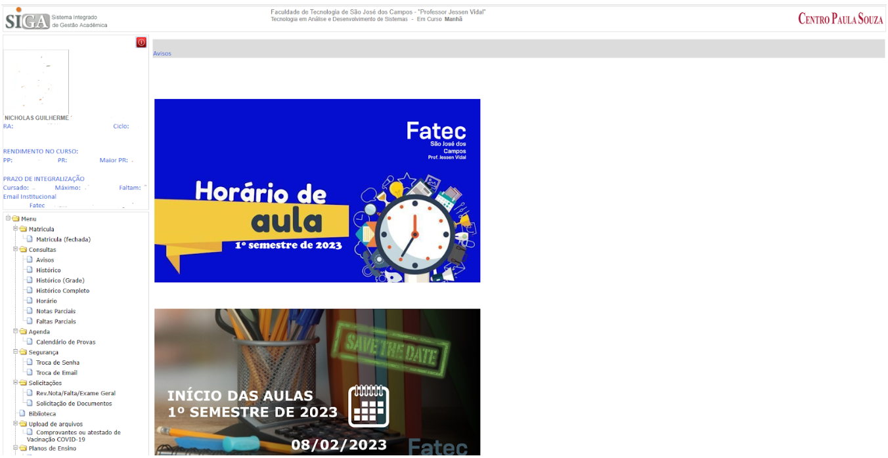

<h1 align="center">Interação Humano Computador</h1>
  
<h2>Interação Humano Computador em relação a usabilidade</h2>

A interação humano-computador (IHC) é uma disciplina que estuda a relação entre os seres humanos e os sistemas computacionais. A usabilidade é um dos principais conceitos estudados pela IHC, e refere-se à facilidade com que os usuários conseguem utilizar um sistema para realizar tarefas específicas. A usabilidade está diretamente relacionada à satisfação do usuário, e um sistema com boa usabilidade tende a ser mais aceito e utilizado pelos usuários.

O design UX (User Experience) e o design UI (User Interface) são duas abordagens diferentes dentro da IHC que visam melhorar a usabilidade dos sistemas computacionais.

O design UX refere-se à experiência do usuário ao utilizar um sistema, levando em consideração suas emoções, sentimentos e expectativas. O design UI, por outro lado, é a área responsável pela criação da interface do sistema, ou seja, como o usuário interage com o sistema.

A importância da IHC e do design UX/UI está em tornar os sistemas mais acessíveis e fáceis de usar pelos usuários, melhorando a experiência geral do usuário. Com uma boa usabilidade, os sistemas podem ser mais eficientes e eficazes, economizando tempo e reduzindo erros. Além disso, a usabilidade pode melhorar a produtividade e a satisfação do usuário, aumentando a aceitação e a adoção de um sistema.

A abordagem de Nielsen sobre a usabilidade destaca a importância da eficácia, eficiência e satisfação do usuário ao utilizar um sistema. De acordo com Nielsen, um sistema com boa usabilidade deve ser fácil de aprender e usar, minimizar a possibilidade de erros, fornecer feedback claro e oferecer controle ao usuário. Além disso, Nielsen também enfatiza a importância da consistência, da simplicidade e da visibilidade do sistema para melhorar a usabilidade.

Sites com pontos negativos de Nielsen:

<h3>SIGA</h3>

Trata-se do sistema online da Secretaria de Educação do Estado de São Paulo, utilizado pelos alunos para acessar informações sobre suas notas, frequência, calendário escolar, entre outras funcionalidades relacionadas à vida escolar.

Consistência e padrões: algumas seções do site apresentam layout e linguagem diferentes, o que pode confundir o usuário e gerar inconsistência no uso. Como neste exemplo, para o usuário que vai acessar pela primeira vez, vai achar estranho e inconsistência o tamanho das notícias e ao lado, vai estar o menu referente ao histórico, notas, documentos, etc.

<h3>Unifesp</h3>

O site é confuso na organização dos menu e no conteúdo, apresentando um layout  que não está padronizado e o menu apresenta várias subcategorias em um menu só 

desobecendo também, que nem o exemplo anterior, a heurística 4 sobre Consistência e Padronização, onde fica díficil para o usuário se organizar e procurar por determinadas situações

<b><h3>Em andamento...</h3></b>
  

<h2>Artigo sobre a Inteligência Artificial</h2>

A inteligência artificial (IA) é uma área de estudo que busca desenvolver algoritmos e sistemas capazes de realizar tarefas que requerem inteligência humana, como aprendizado, raciocínio, tomada de decisão e reconhecimento de padrões. A IA tem sido objeto de interesse e pesquisa desde o surgimento da ciência da computação, mas tem recebido atenção renovada nas últimas décadas devido ao avanço das tecnologias de processamento e armazenamento de dados.

A IA é uma área multidisciplinar que combina técnicas de matemática, estatística, ciência da computação, engenharia e psicologia para criar sistemas que podem simular a inteligência humana. Existem diferentes abordagens para o desenvolvimento de sistemas de IA, incluindo redes neurais artificiais, sistemas especialistas, lógica difusa, algoritmos genéticos e aprendizado de máquina.

O aprendizado de máquina é uma das abordagens mais populares e eficazes para o desenvolvimento de sistemas de IA. Ele envolve a análise de grandes quantidades de dados para identificar padrões e construir modelos estatísticos que podem ser usados para fazer previsões e tomar decisões. 

<b><h3>Em andamento...</h3></b>

        

  
<h1 align="center">Engenharia de Software</h1>
  
<h2>Atividade 01</h2>

_"We see three critical differences between programming and software engineering: time, scale, and the trade-offs at play. On a software engineering project, engineers need to be more concerned with the passage of time and the eventual need for change. In a software engineering organization, we need to be more concerned about scale and efficiency, both for the software we produce as well as for the organization that is producing it. Finally, as software engineers, we are asked to make more complex decisions with higher-stakes outcomes, often based on imprecise estimates of time and growth. Within Google, we sometimes say, “Software engineering is programming integrated over time.” Programming is certainly a significant part of software engineering: after all, programming is how you generate new software in the first place. If you accept this distinction, it also becomes clear that we might need to delineate between programming tasks (development) and software engineering tasks (development, modification, maintenance). The addition of time adds an important new dimension to programming. Cubes aren’t squares, distance isn’t velocity. Software engineering isn’t programming."_

**Titus Winters, Software Engineering at Google**

Na engenharia de software, existe a preocupação de realizar o estudo aprofundado do software, capturando sua arquitetura junto com uma linguagem de baixo nível e por conta disso, é importante haver a necessidade de planejar, verificando os riscos, prevenção de erros e acessibilidade.  Como exemplo, podemos tomar a linguagem Java, que apesar de ser complexa, aproxima da linguagem do sistema, permitindo que a gente faça em diversos dispostivios, garantindo assim a sua portabilidade e por fazer integração com a Internet das Coisas, como em dispostivos inteligentes. Agora com o Python, que trata-se uma linguagem mais simples e usamos no nosso dia a dia e faz parte de varias areas.

A modificação e manutenção serve para guardar as builds, criando uma estação de versões, falando o que foi consertado e adicionado. A compilação do software e a fase de testes são bastante usado nas organizações, servindo para documentar as alterações na linha de código. Nós sabemos que 80%, nós sempre estaremos corrigindo código ou documentando a mesma e 20% de situações estaremos criando algo inovador. Aqui vem a importância do Trade-Off se trata da existencia de alguma negociação onde há benenificos e custos no mesmo lugar, ou seja, é aquilo que vai ter pontos fortes e pontos fracos em uma só aplicação.

A Engenharia usa materiais acadêmicos, como cálculo, programação linear e álgebra para realizar as aplicações, diferente da programação tradicional, na qual utilizamos apenas a prototipagem, como a criação de fluxogramas, pseudocódigo, DERs e as próprias telas antes de desenvolver a programação em si.

Finalizando, devemos prestar atenção no conceito final, tendo conhecimento que a programação é um complemento da engenharia, que funciona perfeitamente sozinha e que é uma aliada na engenharia.

 

**O que é o trade-off nas escolhas que eu faço no API?**

 

A escolha esta diretamente relacionado com as tecnologias que possuem funções capazes de atender os requisitos funcionais e não funcionais. Escolho com a equipe, a tecnologia que atenda melhor a necessidade do cliente, dando preferencia na forma que o usuario deseja o funcionamento do sistema. Em troca, adquirimos experencia para aprendrmos com linguagens diferentes em cada API, sempre aplicando a metodologia ágil e asssim, desenvolvendo minhas Soft e Hard skills. Em relação a empresa e escola, ambos ganham o reconhecimento de ensino e alavancam um crescimento profissional e didático no mercado de trabalho. 

Considero a perda como um beneficio a ser feito, pois nem todos sabem tudo e a vontade de aplicar algo diferente do usual, traz diversas dificuldades para a equipe, por isso, reconhecemos que precisamos lidar com imprevistos e que cada empresa possui uma tecnologia especifica, e claro, focar em algo que traga melhor assistencia á empresa, podendo ser comparado com a aula de Engenharia de Software, onde é melhor uma pessoa que tenha apenas uma habilidade excelente, do que uma que tenha diversos habilidades em diversos áreas, mas que o processo é mal feito e não é aplicado de forma correta nos projetos.

<h2>Story Card - Loja de perfumes</h2>
 

<b>Requisitos funcionais:</b>

<ul>
  <li>O administrador pode cadastrar informações do produto, tais como nome, descrição, preço e validade.</li>
  <li>O administrador pode visualizar dados dos produtos registrados, como data, hora e local.</li>
  <li>O administrador pode verificar o estoque, como a quantidade e a qualidade.</li>
  <li>O administrador checar a empresa os procedimentos de manutenção e de segurança.</li>
  <li>O usuário pode cadastrar seus dados no site, como CPF, endereço e preferências.</li>
  <li>O usuário pode guardar os itens em um carrinho.</li>
  <li>O usuário pode acompanhar o processo de compras, visualizando o relatório do andamento de quando e onde saiu o produto, se chegou e quando foi pago.</li>
</ul>
 

<b>Requisitos não funcionais:</b>

 
<ul>
  <li>Montagem de um banco de dados relacional: Projeta o modelo DER, para não haver acontecer o envio indevido de dados no banco. Após isso, necessita a configuração no serviço online para que fica disponível na nuvem.</li>
  <li>Protocolo de segurança: O sistema precisa ficar protegido de possíveis invasões e roubos de dados, pois contém informações confidenciais sobre histórico de pagamentos, CPF, endereço previamente cadastrados.</li>
  <li>Portabilidade: Utilizar uma linguagem de baixo nível, permitindo que alteramos a configuração de um código para que seja possível rodar em diversos dispositivos diferentes.</li>
  <li>Otimização: Desenvolver um layout simples e um carrinho que guarda os strings do produto, somando os preços. Por último, com um botão de confirmação.</li>
  <li>Sistema que permita diversas formas de pagamento: O programa pode gerar formas de pagamento em boleto, por pix ou do próprio site.</li>
  <li>Acessibilidade: O sistema precisa ser de fácil acessibilidade, tornando ‘amigável’ para todo o tipo de usuário acessar.</li>
</ul>

<h2>Diagrama de uso</h2>

<h2>Diagrama UML</h2>

<h2>Exibição do projeto</h2>

https://user-images.githubusercontent.com/102360510/203971591-a78ec610-bbe5-419f-8a22-a3f962b06a13.mp4

